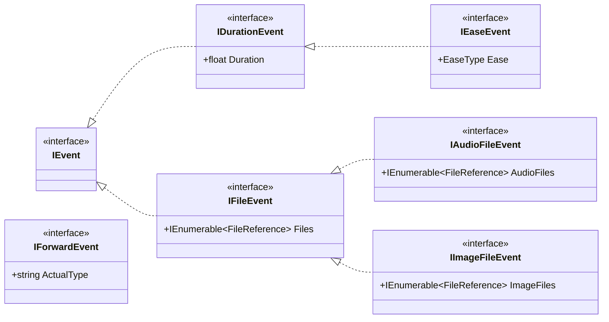

[English](./Tutorial.md) | [中文](./Tutorial.zh-cn.md)

# Table of Contents

- [I. Using RhythmBase](#i-using-rhythmbase)
  - [Project Structure](#project-structure)
  - [Creating, Opening, and Saving Levels](#creating-opening-and-saving-levels)
    - [Creating a Level](#creating-a-level)
    - [Opening a Level](#opening-a-level)
    - [Saving a Level](#saving-a-level)
  - [Base Components](#base-components)
    - [Shared Components](#shared-components)
    - [Game-Specific Components](#game-specific-components)
    - [Enum Collections](#enum-collections)
  - [Events](#events)
    - [Event System](#event-system)
    - [Finding and Querying Events](#finding-and-querying-events)
    - [Creating, Adding, and Removing Events](#creating-adding-and-removing-events)
    - [Custom Events](#custom-events)
    - [Event Types and Enums](#event-types-and-enums)
  - [RichText and Dialogue Components](#richtext-and-dialogue-components)
  - [Easing](#easing)
  - [Utilities](#utilities)
  - [Examples](#examples)
    - [Merging a Beatmap Level with a VFX Level](#merging-a-beatmap-level-with-a-vfx-level)
- [II. Implementing a New Level Type](#ii-implementing-a-new-level-type)
  - [Overview](#overview)
  - [Step 1: Create the Project](#step-1-create-the-project)
  - [Step 2: Define the Event Type Enum](#step-2-define-the-event-type-enum)
  - [Step 3: Define the Time Unit (TickTime)](#step-3-define-the-time-unit-ticktime)
  - [Step 4: Define the Event Interface and Base Class](#step-4-define-the-event-interface-and-base-class)
  - [Step 5: Define Event Subclasses](#step-5-define-event-subclasses)
  - [Step 6: Define the Level Model](#step-6-define-the-level-model)
  - [Step 7: Register AssemblyInfo](#step-7-register-assemblyinfo)
  - [Step 8: Create GlobalUsing](#step-8-create-globalusing)
  - [Step 9: Implement Hand-Written Converters](#step-9-implement-hand-written-converters)
  - [Handling Unhandled Properties](#handling-unhandled-properties)
  - [Step 10: Implement Level Serialization Methods](#step-10-implement-level-serialization-methods)
  - [Implementation-Specific Notes](#implementation-specific-notes)

---

# I. Using RhythmBase

# Project Structure

Namespaces follow the pattern `RhythmBase.[GameType].[CategoryType]`.

- **GameType**: All components for a specific game; enum types also reside here.
  - `Global`: Shared components (used by all games).
  - `RhythmDoctor`: Rhythm Doctor specific components.
  - `Adofai`: A Dance of Fire and Ice specific components.
  - `BeatBlock`: BeatBlock specific components.
  - `Rizline`: Rizline specific components.
- **CategoryType**: Further classification of components.
  - `Components`: Core data models.
  - `Constants`: Predefined constants.
  - `Converters`: Serializers.
  - `Events`: All event data models.
  - `Extensions`: Extension methods.
  - `Utils`: Utility tools.

All game types share the public interfaces (`IEvent`, `ILevel`, `ITickTime`, etc.) and shared components (`Color`, geometry types, `EnumCollection`, etc.) under `RhythmBase.Global`. Each game type implements its own event model, level model, and serializers.

# Creating, Opening, and Saving Levels

The following examples use Rhythm Doctor; other game types have identical API signatures, differing only in class names and file extensions.

## Creating a Level

You can create an empty level, a default level (useful for testing), or deserialize directly from a JSON string or `JsonDocument`.

```cs
using Level emptyLevel = [];
using Level defaultLevel = Level.Default;
using Level jsonLevel = Level.FromJsonString(...);
using Level jsonDocumentLevel = Level.FromJsonDocument(...);
```

> Note: Multi-file formats (BeatBlock, Rizline) do not support JSON read/write, as their level data is spread across multiple files.

## Opening a Level

Supports reading from file paths, streams, or directories. All methods provide async overloads.

> It is recommended to use `using` statements to manage level variables, ensuring resources are released and temporary extracted files are cleaned up when leaving scope.

```cs
using RhythmBase.RhythmDoctor.Components;

LevelReadSettings settings = new()
{
	ZipFileProcessMethod = ZipFileProcessMethod.AllFiles,
	LoadAssets = true,
	InactiveEventsHandling = InactiveEventsHandling.Store,
	UnreadableEventsHandling = UnreadableEventHandling.Store,
};

// Read a level file
using Level rdlevel1 = Level.FromFile(@"your\level.rdlevel");
// Read a level archive
using Level rdlevel2 = Level.FromFile(@"your\level.rdzip");
// Read an archive with custom settings
using Level rdlevel3 = Level.FromFile(@"your\level.zip", settings);
// Read from a stream
using Stream fs = new FileStream(@"your\level.rdlevel", FileMode.Open, FileAccess.Read);
using Level rdlevel4 = Level.FromStream(fs, settings);

// View inactive events
foreach (var inactiveEvent in settings.InactiveEvents)
	Console.WriteLine($"Inactive Event: {inactiveEvent}");
// View unreadable events
foreach (var unreadableEvent in settings.UnreadableEvents)
	Console.WriteLine($"Unreadable Event: {unreadableEvent}");
```

When reading archives, `LevelReadSettings.ZipFileProcessMethod` defaults to `AllFiles`, which extracts level resources to a temporary directory.\
You can customize the temporary directory or clean up manually:

```cs
GlobalSettings.CachePath = "cache";
GlobalSettings.CacheDirectoryPrefix = "MyPrefix";
GlobalSettings.ClearCache();
```

## Saving a Level

Supports saving to a file, stream, or packaging as an archive.\
Can also serialize directly to a JSON string or `JsonDocument` (only for game types that support `IJsonLevel`).

```cs
rdlevel1.SaveToFile(@"your\output1.rdlevel");
rdlevel2.SaveToZip(@"your\output2.rdzip");
rdlevel3.SaveToStream(fs);
Console.WriteLine(rdlevel4.ToJsonString());
JsonDocument jsonDocument = rdlevel4.ToJsonDocument();
```

`LevelReadSettings` and `LevelWriteSettings` each provide lifecycle events:

| Event | Trigger |
|---|---|
| `BeforeReading` | Before reading a level |
| `AfterReading` | After reading a level |
| `BeforeWriting` | Before writing a level |
| `AfterWriting` | After writing a level |

```cs
using RhythmBase.Global.Settings;

LevelWriteSettings settings = new();
settings.AfterWriting += (sender, e) => Console.WriteLine("Level saved!");

rdlevel.SaveToFile(@"your\outLevel.rdlevel", settings);
```

# Base Components

## Shared Components

The following types are located in the `RhythmBase.Global.Components` namespace and are shared across all game types.

### Color `Color`

Color type supporting ARGB component access and multiple string format conversions (`RgbaHex`, `ArgbObject`, etc.). Each game type specifies its default serialization format via `JsonConverterLink` in `AssemblyInfo.cs`.

### Geometry Types

`Point`, `Size`, `Rect`, `RotatedRect` and similar types are all planar geometry data types.

| Suffix | Meaning | Example |
|---|---|---|
| (none) | Nullable float | `Point.X` is `float?` |
| `I` | Nullable integer | `PointI.X` is `int?` |
| `N` | Non-nullable float | `PointN.X` is `float` |
| `NI` | Non-nullable integer | `PointNI.X` is `int` |

> `RotatedRect.Angle` is always float, regardless of suffix rules.

### Range `Range`

Represents a time range, commonly used for event queries. Each game type has its own `Range` implementation (e.g., `RhythmBase.RhythmDoctor.Components.Range`) linked to its corresponding time unit.

```cs
using RhythmBase.RhythmDoctor.Components;

var result = rdlevel.InRange(new Range(rdlevel.DefaultBeat + 10, null));
```

### Enum Collections

`EnumCollection<TEnum>` and `ReadOnlyEnumCollection<TEnum>` are high-performance enum value collections backed by bitmap storage.

- `EnumCollection<TEnum>`: Mutable collection, supports `Add` and `Remove`.
- `ReadOnlyEnumCollection<TEnum>`: Immutable collection, used for type classification and batch filtering.

Both support collection expression syntax:

```cs
using RhythmBase.Global.Components;

// Collection expression creation
ReadOnlyEnumCollection<EventType> types = [
    EventType.AddClassicBeat,
    EventType.AddFreeTimeBeat,
    EventType.MoveRow];

// Mutable collection
EnumCollection<EventType> mutable = [EventType.Tint, EventType.Comment];
mutable.Add(EventType.MoveRow);

// Set operations
ReadOnlyEnumCollection<EventType> a = [EventType.Tint, EventType.Comment];
ReadOnlyEnumCollection<EventType> b = [EventType.Comment, EventType.MoveRow];

var intersect = a.Intersect(b);       // [Comment]
var union = a.Union(b);               // [Tint, Comment, MoveRow]
var except = a.Except(b);             // [Tint]
var symExcept = a.SymmetricExcept(b); // [Tint, MoveRow]

// Membership checks
bool hasTint = a.Contains(EventType.Tint);           // true
bool hasAny = a.ContainsAny(b);                      // true
bool hasAll = a.ContainsAll([EventType.Tint]);        // true
```

`EnumCollection<TEnum>` can be converted to a read-only collection via `AsReadOnly()`.

## Game-Specific Components

Each game type has its own time units, expressions, rooms, etc. The following uses Rhythm Doctor as an example.

### Time Unit `TickTime`

Each game type implements the `ITickTime<TickTime>` interface, representing a point on the level timeline. Rhythm Doctor's implementation is the `TickTime` struct, caching the following read-only information:

- `BeatOnly`: `float`, total beat count from the start of the level (starting from 1).
- `Bar` / `Beat`: `int` / `float`, current bar and beat position, obtained via deconstruction:
  ```cs
  (int bar, float beat) = someBeat;
  ```
- `TimeSpan`: `TimeSpan`, the current moment.
- `Bpm`: `float`, current BPM.
- `Cpb`: `int`, current crotchets per bar.

`TickTime` maintains association with the level when possible, preferring to derive other time units from `BeatOnly`.\
When unassociated, it uses cached values for calculations.

```cs
Level level = [];

// === Associated with level ===
TickTime beat1 = new(level.Calculator, 20);
TickTime beat2 = new(level.Calculator, 3, 5);
TickTime beat3 = new(level.Calculator, TimeSpan.FromSeconds(15));
TickTime beat4 = level.Calculator.BeatOf(20);
TickTime beat5 = level.Calculator.BeatOf(3, 5);
TickTime beat6 = level.Calculator.BeatOf(TimeSpan.FromSeconds(15));
// Level default beat
TickTime beat7 = level.DefaultBeat;
// Link an existing beat to a specific level
TickTime beat8 = beat1.WithLink(level);
TickTime beat9 = beat2.WithLinkIfNull(level);

// === Not associated with level ===
TickTime beat10 = new(20);
TickTime beat11 = new(3, 5);
TickTime beat12 = new(TimeSpan.FromSeconds(15));
// Tuple implicit conversion
TickTime beat13 = (3, 5);
// Break association
TickTime beat14 = beat1.WithoutLink();

// === Check association state ===
bool isLinked = !beat13.IsEmpty;
```

When an event is added to a level, its time unit automatically associates; when removed, it automatically disassociates.\
Two associated time units must point to the same level when used in operations.

```cs
using RhythmBase.RhythmDoctor.Components;

TickTime beat1 = level.Calculator.BeatOf(1);
TickTime beat2 = beat1.WithoutLink();

Console.WriteLine(beat1.FromSameLevel(beat2));       // False
Console.WriteLine(beat1.FromSameLevelOrNull(beat2)); // True
```

### Expression `Expression`

Rhythm Doctor specific, used to store expression strings with basic arithmetic support (parsing and evaluation not yet complete).\
Uses string concatenation internally, so multiple operations may produce nested parentheses.

```cs
using RhythmBase.RhythmDoctor.Components;

Expression exp1 = new("i2+1");
Expression exp2 = new(30);
Expression exp3 = new("25.5");

Expression result = exp1 - exp2 * exp3;

Console.WriteLine(result); // i2+1-765
```

### Other Special Syntax Types

```cs
Order order = [2, 0, 3, 1];

Room room = [2, 3];

RDCharacter c1 = RDCharacters.Samurai;
RDCharacter c2 = "custom_character.png";

RoomHeight roomHeight = (20, 30, 10, 40);
```

# Events

## Event System

All game types implement events via the `IEvent<TType, TBeat>` interface, where `TType` is the event enum type and `TBeat` is the time unit type. Public interfaces are in `RhythmBase.Global.Events`:



Each game type defines its own event interface (e.g., `IBaseEvent`), base classes (e.g., `BaseEvent`, `BaseRowAction`), and concrete event classes on top of these.\
You can browse or filter event types by class diagram. All events are `record` types, supporting `with` expression for copying instances.

## Finding and Querying Events

Level inherits from `OrderedEventCollection`, internally using a red-black tree sorted by time.\
Extension methods allow fast filtering by type, interface, time range, or custom conditions.

```cs
using RhythmBase.RhythmDoctor.Extensions;
using RhythmBase.RhythmDoctor.Components;

// Filter by type
var moves = rdlevel.OfEvent<MoveRow>();

// Filter by time range
var inRange = rdlevel.InRange(level.Calculator.BeatOf(3), level.Calculator.BeatOf(5));

// Filter by exact time
var atBeat = rdlevel.AtBeat(level.Calculator.BeatOf(2, 1));

// Combined conditions
var list = rdlevel.OfEvent<MoveRow>()
	.Where(i => 0 <= i.Y && i.Y < 3)
	.InRange(level.Calculator.BeatOf(3), level.Calculator.BeatOf(5));
```

In Rhythm Doctor, `Row` and `Decoration` also hold event collections, so the above extension methods work on tracks and sprites too.

```cs
var list = rdlevel.Decorations[0]
	.OfEvent<Tint>()
	.InRange(new TickTime(11, 1), new TickTime(13, 1));
```

Event navigation methods are also available for locating adjacent events in ordered collections:

```cs
var prev = someEvent.Before<MoveRow>();
var next = someEvent.Next<MoveRow>();
var front = someEvent.Front();
```

## Creating, Adding, and Removing Events

When creating events, the time unit parameter can be unassociated with a level; once added to a level, association is automatic, and disassociation occurs on removal.

```cs
using RhythmBase.RhythmDoctor.Components;
using RhythmBase.RhythmDoctor.Events;

Comment comment = new() { Beat = new(12), Text = "My_comment." };
Console.WriteLine(comment); // [11,?,?] Comment My_comment.

rdlevel.Add(comment);
Console.WriteLine(comment); // [2,4] Comment My_comment.

rdlevel.Remove(comment);
Console.WriteLine(comment); // [11,?,?] Comment My_comment.
```

In Rhythm Doctor, adding, modifying, or removing `SetCrotchetsPerBar` events automatically updates the timeline.\
Track and sprite events must be added via `Add()` on the corresponding track or sprite; removal can be called at any level (level, track, or sprite).

## Custom Events

If built-in event types are insufficient, you can inherit from `ForwardEvent` (or `ForwardRowEvent`, `ForwardDecorationEvent`).\
Unknown event types encountered during level loading are automatically deserialized as the corresponding `ForwardEvent`.

Every event provides an indexer `this[string propertyName]` for direct JSON property access:

```cs
using RhythmBase.RhythmDoctor.Events;

public class MyEvent : ForwardEvent
{
	public string MyProperty
	{
		get => this["myProperty"].GetString() ?? "";
		set => this["myProperty"] = JsonDocument.Parse($"\"{value}\"").RootElement;
	}

	public MyEvent()
	{
		ActualType = nameof(MyEvent);
	}
}
```

Custom events can be read and written like normal events.\
Note that `Type` remains `EventType.ForwardEvent`; `ActualType` holds the custom type name.

```cs
MyEvent myEvent = new();
rdlevel.Add(myEvent);
myEvent.Beat = new(8);

Console.WriteLine(myEvent.Type);       // ForwardEvent
Console.WriteLine(myEvent.ActualType); // MyEvent
```

> When an undefined event type is encountered during level reading, it is converted to `ForwardEvent`, `ForwardDecorationEvent`, or `ForwardRowEvent` based on field characteristics.
> Events with a `target` field become `ForwardDecorationEvent`, those with a `row` field become `ForwardRowEvent`, others become `ForwardEvent`.

If existing events lack properties, you can use the indexer to get or set property values directly.\
You can also override existing events to create a supplemented event model.

```cs
Comment comment1 = new Comment() { ["extraText"] = JsonElement.Parse("\"hello\"") };
MyComment comment2 = new MyComment() { ExtraText = "hello" };

record MyComment: Comment
{
	public string ExtraText
	{
		get => this["extraText"].GetString() ?? "";
		set => this["extraText"] = JsonElement.Parse($"\"{value}\"");
	}
}
```

## Event Types and Enums

The source generator automatically produces `EnumConverterExtensions` for each game type, providing conversion methods between enums and types. Each game type's `EventTypeRegistry` provides type classification queries.

```cs
using RhythmBase.RhythmDoctor.Components;
using RhythmBase.RhythmDoctor.Events;
using RhythmBase.RhythmDoctor.Converters;

Console.WriteLine(EventType.Tint.ToEnumString()); // "Tint"
Console.WriteLine("Tint".TryParseEventType(out var t)); // true, t = EventType.Tint

// EventTypeRegistry classification queries
var decorationTypes = EventTypeRegistry.ToEnums<BaseDecorationAction>();
var rowTypes = EventTypeRegistry.ToEnums<BaseRowAction>();
```

# RichText and Dialogue Components

RichText is in the `RhythmBase.Global.Components.RichText` namespace, supporting styled text fragment combination via the `+` operator, with serialization/deserialization capabilities.

- `RichLine<TStyle>`: A complete rich text line.
- `Phrase<TStyle>`: A single styled fragment.
- `IRichStringStyle<TStyle>`: Style rule interface.

All can be implicitly converted from `string` (becoming unstyled text).

```cs
using RhythmBase.Global.Components.RichText;

RichLine<RichStringStyle> line = RichLine<RichStringStyle>.Deserialize("Hel<color=#00FF00>lo");

Console.WriteLine(line.ToString());   // Hello
Console.WriteLine(line.Serialize());  // Hel<color=lime>lo</color>

line += new Phrase<RichStringStyle>(" Rhythm") { Style = new() { Color = Color.Lime } };
line += " Doctor!";

Console.WriteLine(line.ToString());   // Hello Rhythm Doctor!
Console.WriteLine(line.Serialize());  // Hel<color=lime>lo Rhythm</color> Doctor!
```

Supports accessing and modifying fragments via indexing:

```cs
RichLine<RichStringStyle> line = RichLine<RichStringStyle>.Deserialize("Hel<color=#00FF00>lo Rhythm</color> Doctor!");

Console.WriteLine(line[6..].ToString());   // Rhythm Doctor!
Console.WriteLine(line[6..].Serialize());  // <color=lime>Rhythm</color> Doctor!

line[5] = " and Welcome to ";

Console.WriteLine(line.ToString());   // Hello and Welcome to Rhythm Doctor!
Console.WriteLine(line.Serialize());  // Hel<color=lime>lo</color> and Welcome to <color=lime>Rhythm</color> Doctor!
```

Dialogue format components are also provided for modular dialogue text construction:

```cs
using RhythmBase.Global.Components.RichText;

DialogueExchange exchange =
[
	new DialogueBlock
	{
		Character = "Paige",
		Expression = "neutral",
		Content = RichLine<DialoguePhraseStyle>.Deserialize("Hel<color=#00FF00>lo [2]<shake>Rhythm</color> Doctor</shake>!"),
	},
	new DialogueBlock
	{
		Character = "Ian",
		Content = "Hello Paige!",
	},
	new DialogueBlock
	{
		Character = "Paige",
		Expression = "happy",
		Content = new Phrase<DialoguePhraseStyle>("What a good day!")
		{
			Events =
			[
				new DialogueTone(DialogueToneType.VerySlow, 6),
				new DialogueTone(DialogueToneType.Static, 11),
			],
			Style = new DialoguePhraseStyle
			{
				Volume = 0.5f,
				Bold = true,
			},
		}
	}
];

Console.WriteLine(exchange.Serialize());
// Paige_neutral:Hel<color=lime>lo [2]<shake>Rhythm</color> Doctor</shake>!
// Ian:Hello Paige!
// Paige_happy:<volume=0.5><bold>What a[vslow] good[static] day!</volume></bold>
```

# Easing

After importing `RhythmBase.Global.Components.Easing`, you can use the `EaseType` enum directly and compute easing values via the `Calculate()` extension method.

```cs
using RhythmBase.Global.Components.Easing;

double var1 = EaseType.InSine.Calculate(0.25);
double var2 = EaseType.Linear.Calculate(0.5, 4, 9);

Console.WriteLine(var1); // 0.07612046748871326
Console.WriteLine(var2); // 6.5
```

# Utilities

## Rhythm Doctor

### Beat Calculator `BeatCalculator`

Automatically created with the `Level`, accessed via `Level.Calculator`.\
Used to construct associated `TickTime` instances, convert between various time units on the level timeline, and query BPM and CPB at any moment.

```cs
Level level = [];
BeatCalculator calculator = level.Calculator;

Console.WriteLine(calculator.BarBeatToBeatOnly(3, 1));
Console.WriteLine(calculator.BarBeatToTimeSpan(3, 1));
Console.WriteLine(calculator.BeatOnlyToBarBeat(3));
Console.WriteLine(calculator.BeatOnlyToTimeSpan(3));
Console.WriteLine(calculator.TimeSpanToBarBeat(TimeSpan.FromSeconds(3)));
Console.WriteLine(calculator.TimeSpanToBeatOnly(TimeSpan.FromSeconds(3)));

Console.WriteLine(calculator.BeatsPerMinuteOf((3, 1)));
Console.WriteLine(calculator.CrotchetsPerBarOf((3, 1)));
```

You can manually refresh the internal cache via `BeatCalculator.Refresh()`.

### RDCode Parser `RDLang` (Deprecated)

Provides a `TryRun()` method for evaluating Rhythm Doctor expressions.

```cs
using RhythmBase.RhythmDoctor.Components.RDLang;

RDLang.Variables.i[1] = 9;

RDLang.TryRun("numMistakesP2 = 3", out float result); // 3
RDLang.TryRun("numMistakesP2+i1", out result);        // 12
RDLang.TryRun("atLeastRank(A)", out result);          // 1
```

## A Dance of Fire and Ice

### Beat Calculator `BeatCalculator` (WIP)

Created with `ADLevel`, accessed via `ADLevel.Calculator`.

# Examples

## Merging a Beatmap Level with a VFX Level

```cs
using RhythmBase.RhythmDoctor.Components;
using RhythmBase.RhythmDoctor.Events;
using RhythmBase.RhythmDoctor.Extensions;

// Load VFX level
using Level vfxLevel = Level.FromFile(@"vfx.rdlevel");
// Load beatmap level
using Level audioLevel = Level.FromFile(@"beat.rdlevel");

// Remove all tracks from VFX level
foreach (var row in vfxLevel.Rows.ToList())
	vfxLevel.Rows.Remove(row);

// Copy tracks from beatmap level to VFX level
foreach (var row in audioLevel.Rows)
{
	Row row2 = new()
	{
		Rooms = row.Rooms,
		Character = row.Character,
		Sound = row.Sound,
		RowType = row.RowType
	};
	vfxLevel.Rows.Add(row2);

	foreach (var evt in row.OfEvent<BaseBeat>())
		row2.Add(evt);
}

// Copy non-track events from sound bar
foreach (var sound in audioLevel.Where(e =>
	e.Tab == Tabs.Sounds &&
	e is not BaseRowAction &&
	e is not PlaySong &&
	e is not SetCrotchetsPerBar))
{
	vfxLevel.Add(sound);
}

// Save result
vfxLevel.SaveToFile(@"result.rdlevel");
```

---

# II. Implementing a New Level Type

## Overview

The process of adapting a new game can be summarized as:

```
Define Enum → Define TickTime → Define Event Interface/Base Class → Define Event Subclasses
→ Define Level → Register AssemblyInfo → Implement Hand-Written Converters → Implement Serialization Methods
```

The source generator automatically produces the following based on declarations in `AssemblyInfo.cs`:
- Property-level converters for each event class (`MemberConverter<T>`)
- Bidirectional type-enum mappings (`EventTypeRegistry`)
- Converter routing table (`EventConverterMap`)
- String conversion extension methods for enums (`TryParse` / `ToEnumString`)

The following uses `MyGame` as a hypothetical game type name. The four completed implementations (RhythmDoctor, Adofai, BeatBlock, Rizline) serve as practical references.

## Step 1: Create the Project

Create a .NET class library project and reference the `RhythmBase` NuGet package:

```xml
<Project Sdk="Microsoft.NET.Sdk">
  <PropertyGroup>
    <TargetFrameworks>net8.0;netstandard2.0</TargetFrameworks>
    <RootNamespace>RhythmBase</RootNamespace>
    <LangVersion>latest</LangVersion>
    <AllowUnsafeBlocks>true</AllowUnsafeBlocks>
  </PropertyGroup>
  <ItemGroup>
    <PackageReference Include="RhythmBase" Version="*" />
  </ItemGroup>
</Project>
```

> **`RootNamespace` must be set to `RhythmBase`** to ensure the source generator places generated code in the correct `RhythmBase.{GameType}.Converters` namespace.

## Step 2: Define the Event Type Enum

Create `Enums.cs` and mark it with `[JsonEnumSerializable]`:

```csharp
namespace RhythmBase.MyGame;

[JsonEnumSerializable]
public enum EventType
{
    Note,
    Drag,
    // ... all event types
    ForwardEvent,            // Fallback compatibility type (optional)
}
```

**Rules**:
- Enum member names must exactly match event class names
- Fallback compatibility types are fixed: `ForwardEvent`, `ForwardRowEvent`, `ForwardDecorationEvent`
- Must be marked with `[JsonEnumSerializable]`

**Implementation differences**:

| Implementation | Difference | Syntax |
|---|---|---|
| RhythmDoctor | Default PascalCase | `[JsonEnumSerializable]` |
| BeatBlock | camelCase serialization | `[JsonEnumSerializable(false)]` |
| Rizline | Numeric member names, serialized as numbers | Member names like `_0`, `_1` |
| Adofai | Multiple enums coexist | Register `EventType` + `FilterType` separately |

## Step 3: Define the Time Unit (TickTime)

Create a struct implementing `ITickTime<TickTime>`, representing a point on the level timeline:

```csharp
public struct TickTime : ITickTime<TickTime>
{
    public TimeSpan TimeSpan { get; }
    public float Tick { get; }
    // ... comparison operators, constructors, etc.
}
```

Key design points:
- Support construction from `float` (beat), `(bar, beat)` tuple, `TimeSpan`, etc.
- Associate/disassociate with `BeatCalculator` (lazy computation + caching)
- Support tuple implicit conversion: `(int bar, float beat) => TickTime`
- Comparison operators (`>`, `<`, `>=`, `<=`, `==`, `!=`)

Reference implementation: `RhythmBase.RhythmDoctor/RhythmDoctor/Components/TickTime.cs`

## Step 4: Define the Event Interface and Base Class

**Event interface** (namespace-scoped):

```csharp
public interface IBaseEvent : IEvent<EventType, TickTime>
{
    bool Active { get; set; }
    new TickTime TickTime { get; set; }
    // ... game-specific common properties
    JsonElement this[string propertyName] { get; set; }
}
```

**Event base class**:

```csharp
public abstract record class BaseEvent : IBaseEvent
{
    public abstract EventType Type { get; }
    public virtual TickTime TickTime { get; set; }
    public bool Active { get; set; } = true;

    internal Dictionary<string, JsonElement> _extraData = [];

    public JsonElement this[string propertyName]
    {
        get => _extraData.TryGetValue(propertyName, out var v) ? v : default;
        set => _extraData[propertyName] = value;
    }
}
```

The `_extraData` dictionary stores unknown properties, ensuring lossless round-tripping.

**Typical inheritance tree** (choose based on game characteristics):

```
BaseEvent (abstract)
├── BaseRowAction (abstract)         # Row event base, with "row" field
│   ├── BaseBeat (abstract)          # Beat event base
│   └── ...
├── BaseDecorationAction (abstract)  # Decoration event base, with "target" field
├── BaseBeatsPerMinute (abstract)    # BPM event base
└── ...
```

Not all games need the row/decoration distinction. Adofai's event tree uses `BaseTileEvent` as the main branch; BeatBlock and Rizline have flatter event trees.

## Step 5: Define Event Subclasses

Each event class is marked with `[JsonObjectSerializable]`:

```csharp
[JsonObjectSerializable]
public record class Note : BaseEvent
{
    public override EventType Type { get; } = EventType.Note;
    // ... event-specific properties
}
```

**Property attributes**:

| Attribute | Purpose |
|---|---|
| `[JsonObjectSerializable]` | Auto-generate serializer |
| `[JsonObjectHasSerializer(typeof(C))]` | Has custom serializer, still needs mapping |
| `[JsonObjectNotSerializable]` | No serializer needed (e.g., `ForwardEvent`) |
| `[JsonObjectSerializationFallback]` | Fallback model for unknown types (globally unique) |
| `[JsonAlias("name")]` | Alias used in JSON |
| `[JsonIgnore]` | Ignored during serialization |
| `[JsonCondition("$&.Prop != value")]` | Conditional write |
| `[JsonTime(JsonTimeType.Milliseconds)]` | TimeSpan serialized as milliseconds/seconds |
| `[JsonConverter(typeof(C))]` | Use specified converter |

## Step 6: Define the Level Model

```csharp
public partial class Level :
    OrderedEventCollection<IBaseEvent, EventType, TickTime>,
    IArchiveLevel<Level, IBaseEvent, EventType, TickTime>,
    // Choose interfaces based on format
    IChart<TickTime>
{
    // ... game-specific components (Settings, Rows, etc.)

    protected override TickTime CreateInstance(float beat) => new TickTime(beat);
    protected override ReadOnlyEnumCollection<EventType> Types => EventTypeRegistry.Types;
    protected override ReadOnlyEnumCollection<EventType> TypesOf<TTarget>() => EventTypeRegistry.ToEnums(typeof(TTarget));
}
```

**Level format selection**:

| Interface | Suitable format | Existing implementations |
|---|---|---|
| `ISingleFileLevel` | Single file | RhythmDoctor (`.rdlevel`), Adofai (`.adofai`) |
| `IArchiveLevel` | Archive | All four |
| `IJsonLevel` | JSON fully representable | RhythmDoctor, Adofai |
| `IMultiFileLevel` | Multi-file directory | BeatBlock, Rizline |

Multi-file formats (BeatBlock, Rizline) do not implement `IJsonLevel` because JSON strings cannot fully represent level data distributed across multiple files.

## Step 7: Register AssemblyInfo

Create `AssemblyInfo.cs` in the project root:

```csharp
[assembly: RhythmBase.JsonConverterId(nameof(RhythmBase.MyGame))]

[assembly: RhythmBase.JsonConverterSourceType(
    typeof(IBaseEvent),                                    // Event interface
    typeof(RhythmBase.MyGame.EventType),                   // Event enum
    typeof(RhythmBase.MyGame.Converters.MemberConverter<>), // Converter base class
    nameof(IBaseEvent.Type)                                // Enum property name
)]

// Link custom converters for shared types (as needed)
[assembly: RhythmBase.JsonConverterLink(typeof(Color), typeof(ColorConverter.RgbaHex))]
[assembly: RhythmBase.JsonConverterLink(typeof(RichLine<RichStringStyle>), typeof(RichTextConverter<RichStringStyle>))]
```

**`JsonConverterLink` differences across implementations**:

| Implementation | Color format |
|---|---|
| RhythmDoctor | `ColorConverter.RgbaHex` |
| Adofai | `ColorConverter.RgbaHex` |
| BeatBlock | `ColorConverter.RgbObject` |
| Rizline | `ColorConverter.ArgbObject` |

**Multi-target registration** (e.g., Adofai registers both events and filters):

```csharp
[assembly: RhythmBase.JsonConverterSourceType(typeof(IBaseEvent), typeof(EventType), typeof(MemberConverter<>), nameof(IBaseEvent.Type))]
[assembly: RhythmBase.JsonConverterSourceType(typeof(IFilter), typeof(FilterType), typeof(FilterMemberConverter<>), nameof(IFilter.Type))]
```

## Step 8: Create GlobalUsing

Create `GlobalUsing.cs` in the project root:

```csharp
global using RhythmBase.Global.Components;
global using RhythmBase.Global.Events;
global using RhythmBase.Global.Exceptions;
global using RhythmBase.Global.Extensions;
global using RhythmBase.Global.Settings;
global using RhythmBase.Global.Converters.JsonSerialization;
global using RhythmBase.Global.Utils;
global using static RhythmBase.Global.Constants.Constants;
global using static RhythmBase.Global.Converters.EnumConverterExtensions;
global using static RhythmBase.MyGame.Converters.EnumConverterExtensions;
```

## Step 9: Implement Hand-Written Converters

The source generator auto-generates event property-level converters, but the following compound types need hand-written converters:

- **LevelConverter**: Reads/writes the entire level
- **SettingsConverter**: Reads/writes level settings
- **BaseEventConverter**: Event type routing (dispatches to `ConverterMap` based on the `type` field)

All hand-written converters inherit from `MetadataJsonConverter<T>`, whose `Read`/`Write` accept `MetadataJsonSerializerOptions` (serialization options with attached metadata).

**Converter hierarchy**:

```
JsonConverter<T>              — .NET framework, handles arbitrary type JSON serialization
└── MetadataJsonConverter<T>  — RhythmBase, adds metadata awareness
    ├── LevelConverter        — reads/writes entire level
    ├── SettingsConverter     — reads/writes settings
    ├── BaseEventConverter    — event routing
    └── ...

MemberConverter<T>            — RhythmBase, reads/writes event properties field by field
├── BaseRowAction<T>          — + "row"
├── BaseDecorationAction<T>   — + "target"
└── Concrete event converter  — generated by source generator
```

Division of labor: **`MetadataJsonConverter` manages the `{ }` boundary; `MemberConverter` manages the fields inside `{ }`.**

## Handling Unhandled Properties

During deserialization, the converter system automatically maps JSON properties to event model fields. When a property is not recognized by the converter, it falls back to storing the value in the event's `_extraData` dictionary (accessible via the indexer `event["propertyName"]`).

For more control over this behavior, RhythmBase provides a two-level handler system:

- **Developer level** (`UnhandledFieldRegistry`): Registered at startup, handles all deserialization operations.
- **User level** (`LevelReadSettings.RegisterHandler`): Registered per read operation, runs after developer handlers.

Both levels use the same delegate type `UnhandledPropertyHandler<T>` and support interface-based dispatch.

### Developer Level: `UnhandledFieldRegistry`

Handlers registered here are global and apply to all level reads.

**Concrete type registration** (matches only the exact type):

```cs
UnhandledFieldRegistry.Register<PlaySong>("customVolume", (ref PlaySong e, JsonElement value) =>
{
    e.Volume = value.GetSingle();
    return true; // handled
});

// Ignore a specific field silently
UnhandledFieldRegistry.Ignore<SetClapSounds>("legacyField");
```

**Interface-based registration** (matches all concrete types implementing the interface):

The source generator produces `RegisterForXXX` methods for each interface found in the event type hierarchy. Each method internally registers a wrapped handler for every concrete type, using `Unsafe.As` to convert `ref ConcreteType` to `ref InterfaceType` — no boxing, no allocation.

```cs
// Generated method: covers TintRows, Tint, PaintHands, etc.
UnhandledFieldHelper.RegisterForITintEvent("borderOpacity", (ref ITintEvent e, JsonElement value) =>
{
    if (!value.TryGetInt32(out int alpha)) return false;
    var c = e.BorderColor.Color;
    c.A = (byte)(alpha / 100f * 255);
    e.BorderColor = c;
    return true;
});

// Ignore for all types implementing the interface
UnhandledFieldHelper.RegisterForITintEvent("legacyOpacity", (ref ITintEvent _, JsonElement __) => true);
```

### User Level: `LevelReadSettings`

Handlers registered here are per-operation and run after developer handlers.

```cs
var settings = new LevelReadSettings();
settings.RegisterHandler<PlaySong>("mod_customVolume", (ref PlaySong e, JsonElement value) =>
{
    e.Volume = value.GetSingle();
    return true;
});
```

Interface-based registration is also supported:

```cs
settings.RegisterHandler<ITintEvent>("mod_customTint", (ref ITintEvent e, JsonElement value) =>
{
    e.TintColor = new PaletteColorWithAlpha(value.GetString());
    return true;
});
```

### Matching Mechanism

Both levels use enum-based matching via `EventTypeRegistry`. The registered type is converted to a `ReadOnlyEnumCollection<EventType>` at registration time. At dispatch time, the event's `Type` property is checked against this collection using O(1) bit operations. This means interface-based handlers only fire for events whose `EventType` belongs to the registered set — no redundant checks.

### Summary

| Feature | Developer (`UnhandledFieldRegistry`) | User (`LevelReadSettings`) |
|---|---|---|
| Scope | Global, all reads | Per-operation |
| Registration | `Register<T>` / `Ignore<T>` / `RegisterForXXX` | `RegisterHandler<T>` |
| Interface support | Via source-generated `RegisterForXXX` | Built-in, AOT-compatible |
| Matching | Enum-based, O(1) | Enum-based, O(1) |
| Fallback | `_extraData` dictionary | `_extraData` dictionary |

## Step 10: Implement Level Serialization Methods

Implement read/write methods in `Level.SerializeMethods.cs` (partial class). Core call chain:

```csharp
// Reading
Level? level = FileMainEntryConverter.DeserializeMainEntry<Level>(
    new StreamDataSource(rdlevelStream), options);

// Writing
FileMainEntryConverter.SerializeMainEntry(this, stream, options);
```

**ZIP format** uniformly uses the "extract to temp directory → call FromDirectory" pattern:

```csharp
public static async Task<Level> FromZipAsync(string filepath, LevelReadSettings? settings = null, ...)
{
    DirectoryInfo tempDirectory = new(Path.Combine(
        GlobalSettings.CachePath, GlobalSettings.CacheDirectoryPrefix + Path.GetRandomFileName()));
    ZipFile.ExtractToDirectory(stream, tempDirectory.FullName, overwriteFiles: true);
    Level level = await FromDirectoryAsync(tempDirectory.FullName, settings, cancellationToken);
    level.ResolvedPath = Path.GetFullPath(filepath);
    level.Filepath = Path.GetFullPath(filepath);
    return level;
}
```

**Multi-file formats** also need `FromDirectoryAsync` / `SaveToDirectoryAsync` to read/write sub-files by filename convention.

**`Filepath` / `ResolvedPath` / `ResolvedDirectory` properties**: Multi-file formats need `internal set` to allow assignment in `FromZip` / `FromDirectory`.

## Implementation-Specific Notes

### Rhythm Doctor

- Single file format (`.rdlevel`), fully supports `IJsonLevel`
- Events organized by Row and Decoration
- Has `BeatCalculator` for beat ↔ time conversion
- Color uses `RgbaHex` format
- Reference implementation — consult this project first when adapting new games

### Adofai

- Supports multiple `JsonConverterSourceType`: event system and filter system registered separately
- Filter types use **structs** (`struct BlurRegular : IFilter`), not classes
- Color uses `RgbaHex` format
- Multiple enums defined in one project (`EventType` + `FilterType`)

### BeatBlock

- Enum uses camelCase: `[JsonEnumSerializable(false)]`
- Multi-file format: `manifest.json` (main) + `level.json` + `chart-*.json` + `tags/`
- Does not implement `IJsonLevel`
- Level implements `IDisposable`, requires manual resource management
- Color uses `RgbObject` format
- Has `version` field, level has multiple version formats
- `Filepath` / `ResolvedPath` / `ResolvedDirectory` properties need `internal set`

### Rizline

- Enum members are numeric: e.g., `EventType._0`, serialized as `"0"`
- Multi-file format: `metadata.json` + `chart*.json`
- Does not implement `IJsonLevel`
- Color uses `ArgbObject` format
- `Filepath` / `ResolvedPath` / `ResolvedDirectory` properties need `internal set`

### Common Notes

1. All events are `record` types, supporting `with` expressions
2. `_extraData` dictionary stores unknown properties, ensuring lossless round-tripping
3. The source generator handles most serialization code; hand-written converters are only for complex logic
4. `ConverterMap` + `ConverterHub` form the complete type routing and serializer registration system
5. `EventTypeRegistry` provides bidirectional type-enum queries and classification
6. `ForwardEvent` mechanism ensures backward compatibility for unknown event types
7. `Path.GetRelativePath` is unavailable on .NET Standard 2.0; use `file.Substring(dir.Length + 1)` instead
8. Multi-file format `FromZip` needs to set `isZip` / `isExtracted` status fields
