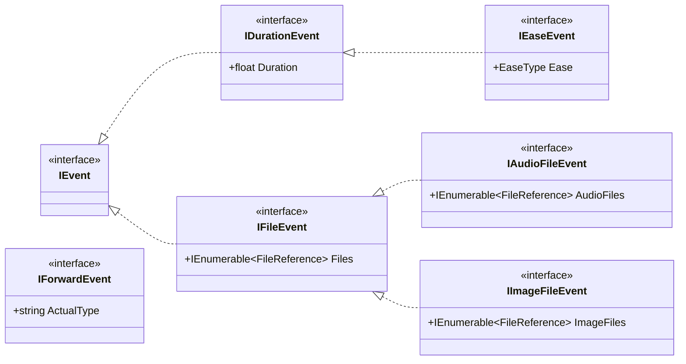

[English](./Tutorial.md) | 中文

# 目录

- [一、使用 RhythmBase](#一使用-rhythmbase)
  - [项目结构](#项目结构)
  - [关卡的创建、打开与保存](#关卡的创建打开与保存)
    - [创建关卡](#创建关卡)
    - [打开关卡](#打开关卡)
    - [保存关卡](#保存关卡)
  - [基础组件](#基础组件)
    - [公共组件](#公共组件)
    - [游戏特有组件](#游戏特有组件)
    - [枚举集合](#枚举集合)
  - [事件](#事件)
    - [事件体系](#事件体系)
    - [查找和获取事件](#查找和获取事件)
    - [创建和增删事件](#创建和增删事件)
    - [自定义事件](#自定义事件)
    - [事件类型与枚举](#事件类型与枚举)
  - [富文本和对话组件](#富文本和对话组件)
  - [缓动](#缓动)
  - [辅助工具](#辅助工具)
  - [案例](#案例)
    - [合并采音关卡与视效关卡](#合并采音关卡与视效关卡)
- [二、实现新的关卡类型](#二实现新的关卡类型)
  - [概览](#概览)
  - [步骤 1：创建项目](#步骤-1创建项目)
  - [步骤 2：定义事件类型枚举](#步骤-2定义事件类型枚举)
  - [步骤 3：定义时间单位（TickTime）](#步骤-3定义时间单位ticktime)
  - [步骤 4：定义事件接口和基类](#步骤-4定义事件接口和基类)
  - [步骤 5：定义事件子类](#步骤-5定义事件子类)
  - [步骤 6：定义关卡模型（Level）](#步骤-6定义关卡模型level)
  - [步骤 7：注册 AssemblyInfo](#步骤-7注册-assemblyinfo)
  - [步骤 8：创建 GlobalUsing](#步骤-8创建-globalusing)
  - [步骤 9：实现手写转换器](#步骤-9实现手写转换器)
  - [步骤 10：实现关卡序列化方法](#步骤-10实现关卡序列化方法)
  - [各实现的特殊处理](#各实现的特殊处理)

---

# 一、使用 RhythmBase

# 项目结构

命名空间统一为 `RhythmBase.[游戏类型].[综合类型]`。

- **游戏类型**：针对特定游戏的全部组件，枚举类型也直接位于此处。
  - `Global`：公共组件（所有游戏共享）。
  - `RhythmDoctor`：节奏医生专用组件。
  - `Adofai`：冰与火之舞专用组件。
  - `BeatBlock`：节奏方块专用组件。
  - `Rizline`：Rizline 专用组件。
- **综合类型**：对各分支组件的进一步归类。
  - `Components`：基本数据模型。
  - `Constants`：预定义常量。
  - `Converters`：序列化器。
  - `Events`：所有事件的数据模型。
  - `Extensions`：扩展方法。
  - `Utils`：基础工具。

所有游戏类型共享 `RhythmBase.Global` 下的公共接口（`IEvent`、`ILevel`、`ITickTime` 等）和公共组件（`Color`、几何类型、`EnumCollection` 等）。每个游戏类型实现自己的事件模型、关卡模型和序列化器。

# 关卡的创建、打开与保存

以下以节奏医生为例，其他游戏类型的 API 签名一致，仅类名和文件扩展名不同。

## 创建关卡

可以创建空关卡、模板关卡（常用于测试），也可以直接从 JSON 字符串或 `JsonDocument` 反序列化关卡。

```cs
using Level emptyLevel = [];
using Level defaultLevel = Level.Default;
using Level jsonLevel = Level.FromJsonString(...);
using Level jsonDocumentLevel = Level.FromJsonDocument(...);
```

> 注意：多文件格式（BeatBlock、Rizline）不支持 JSON 读写，因其关卡数据分布在多个文件中。

## 打开关卡

支持从文件路径、流或目录读取关卡，所有方法均提供异步重载。

> 建议使用 `using` 语句管理关卡变量，以确保在离开作用域时释放资源并清理临时解压文件。

```cs
using RhythmBase.RhythmDoctor.Components;

LevelReadSettings settings = new()
{
	ZipFileProcessMethod = ZipFileProcessMethod.AllFiles,
	LoadAssets = true,
	InactiveEventsHandling = InactiveEventsHandling.Store,
	UnreadableEventsHandling = UnreadableEventHandling.Store,
};

// 读取关卡文件
using Level rdlevel1 = Level.FromFile(@"your\level.rdlevel");
// 读取关卡包文件
using Level rdlevel2 = Level.FromFile(@"your\level.rdzip");
// 使用自定义配置读取压缩包
using Level rdlevel3 = Level.FromFile(@"your\level.zip", settings);
// 从流中读取
using Stream fs = new FileStream(@"your\level.rdlevel", FileMode.Open, FileAccess.Read);
using Level rdlevel4 = Level.FromStream(fs, settings);

// 查看被禁用的事件
foreach (var inactiveEvent in settings.InactiveEvents)
	Console.WriteLine($"Inactive Event: {inactiveEvent}");
// 查看读取异常的事件
foreach (var unreadableEvent in settings.UnreadableEvents)
	Console.WriteLine($"Unreadable Event: {unreadableEvent}");
```

读取压缩包时，`LevelReadSettings.ZipFileProcessMethod` 默认为 `AllFiles`，会将关卡资源解压到临时目录。\
可通过以下方式自定义临时目录或手动清理：

```cs
GlobalSettings.CachePath = "cache";
GlobalSettings.CacheDirectoryPrefix = "MyPrefix";
GlobalSettings.ClearCache();
```

## 保存关卡

支持将关卡保存到文件、流，或打包为关卡包。\
也可直接序列化为 JSON 字符串或 `JsonDocument`（仅支持 `IJsonLevel` 的游戏类型）。

```cs
rdlevel1.SaveToFile(@"your\output1.rdlevel");
rdlevel2.SaveToZip(@"your\output2.rdzip");
rdlevel3.SaveToStream(fs);
Console.WriteLine(rdlevel4.ToJsonString());
JsonDocument jsonDocument = rdlevel4.ToJsonDocument();
```

`LevelReadSettings` 和 `LevelWriteSettings` 分别提供了生命周期事件：

| 事件 | 触发时机 |
|---|---|
| `BeforeReading` | 读取关卡前 |
| `AfterReading` | 读取关卡后 |
| `BeforeWriting` | 写入关卡前 |
| `AfterWriting` | 写入关卡后 |

```cs
using RhythmBase.Global.Settings;

LevelWriteSettings settings = new();
settings.AfterWriting += (sender, e) => Console.WriteLine("Level saved!");

rdlevel.SaveToFile(@"your\outLevel.rdlevel", settings);
```

# 基础组件

## 公共组件

以下类型位于 `RhythmBase.Global.Components` 命名空间，所有游戏类型共享。

### 颜色 `Color`

颜色类型，支持 ARGB 分量访问和多种格式的字符串转换（`RgbaHex`、`ArgbObject` 等）。每个游戏类型在 `AssemblyInfo.cs` 中通过 `JsonConverterLink` 指定默认的序列化格式。

### 几何类型

`Point`、`Size`、`Rect`、`RotatedRect` 等类型均为平面几何数据类型。

| 后缀 | 含义 | 示例 |
|---|---|---|
| 无后缀 | 可空浮点 | `Point.X` 为 `float?` |
| `I` | 可空整数 | `PointI.X` 为 `int?` |
| `N` | 非空浮点 | `PointN.X` 为 `float` |
| `NI` | 非空整数 | `PointNI.X` 为 `int` |

> `RotatedRect` 的 `Angle` 始终为浮点型，不受后缀规则约束。

### 范围 `Range`

表示时间范围的类型，常用于事件查询。每个游戏类型有自己的 `Range` 实现（如 `RhythmBase.RhythmDoctor.Components.Range`），关联到对应的时间单位。

```cs
using RhythmBase.RhythmDoctor.Components;

var result = rdlevel.InRange(new Range(rdlevel.DefaultBeat + 10, null));
```

### 枚举集合

`EnumCollection<TEnum>` 和 `ReadOnlyEnumCollection<TEnum>` 是高性能的枚举值集合，底层使用位图（bitmap）存储。

- `EnumCollection<TEnum>`：可变集合，支持 `Add`、`Remove`。
- `ReadOnlyEnumCollection<TEnum>`：不可变集合，用于类型分类和批量筛选。

两者均支持集合表达式语法：

```cs
using RhythmBase.Global.Components;

// 集合表达式创建
ReadOnlyEnumCollection<EventType> types = [
    EventType.AddClassicBeat,
    EventType.AddFreeTimeBeat,
    EventType.MoveRow];

// 可变集合
EnumCollection<EventType> mutable = [EventType.Tint, EventType.Comment];
mutable.Add(EventType.MoveRow);

// 集合运算
ReadOnlyEnumCollection<EventType> a = [EventType.Tint, EventType.Comment];
ReadOnlyEnumCollection<EventType> b = [EventType.Comment, EventType.MoveRow];

var intersect = a.Intersect(b);       // [Comment]
var union = a.Union(b);               // [Tint, Comment, MoveRow]
var except = a.Except(b);             // [Tint]
var symExcept = a.SymmetricExcept(b); // [Tint, MoveRow]

// 成员检查
bool hasTint = a.Contains(EventType.Tint);           // true
bool hasAny = a.ContainsAny(b);                      // true
bool hasAll = a.ContainsAll([EventType.Tint]);        // true
```

`EnumCollection<TEnum>` 可通过 `AsReadOnly()` 转换为只读集合。

## 游戏特有组件

每个游戏类型有自己的时间单位、表达式、房间等组件。以下以节奏医生为例。

### 时间单位 `TickTime`

每个游戏类型实现 `ITickTime<TickTime>` 接口，表示关卡时间线上的某个时刻。节奏医生的实现为 `TickTime` 结构体，缓存了以下只读信息：

- `BeatOnly`：`float`，从关卡起始算起的总节拍数（从 1 开始）。
- `Bar` / `Beat`：`int` / `float`，当前所在小节与拍数，通过解构获取：
  ```cs
  (int bar, float beat) = someBeat;
  ```
- `TimeSpan`：`TimeSpan`，当前时刻。
- `Bpm`：`float`，当前 BPM。
- `Cpb`：`int`，当前每小节四分音符数。

`TickTime` 会尽量与关卡保持关联，并优先通过 `BeatOnly` 推算其他时间单位。\
无关联时则使用缓存值参与计算。

```cs
Level level = [];

// === 与关卡关联 ===
TickTime beat1 = new(level.Calculator, 20);
TickTime beat2 = new(level.Calculator, 3, 5);
TickTime beat3 = new(level.Calculator, TimeSpan.FromSeconds(15));
TickTime beat4 = level.Calculator.BeatOf(20);
TickTime beat5 = level.Calculator.BeatOf(3, 5);
TickTime beat6 = level.Calculator.BeatOf(TimeSpan.FromSeconds(15));
// 关卡默认节拍
TickTime beat7 = level.DefaultBeat;
// 将已有节拍链接到指定关卡
TickTime beat8 = beat1.WithLink(level);
TickTime beat9 = beat2.WithLinkIfNull(level);

// === 不与关卡关联 ===
TickTime beat10 = new(20);
TickTime beat11 = new(3, 5);
TickTime beat12 = new(TimeSpan.FromSeconds(15));
// 使用元组隐式转换
TickTime beat13 = (3, 5);
// 断开关联
TickTime beat14 = beat1.WithoutLink();

// === 检查关联状态 ===
bool isLinked = !beat13.IsEmpty;
```

事件被添加至关卡时会自动建立时间单位关联，移除时自动断开。\
两个有关联的时间单位参与运算时，需确保指向同一关卡。

```cs
using RhythmBase.RhythmDoctor.Components;

TickTime beat1 = level.Calculator.BeatOf(1);
TickTime beat2 = beat1.WithoutLink();

Console.WriteLine(beat1.FromSameLevel(beat2));       // False
Console.WriteLine(beat1.FromSameLevelOrNull(beat2)); // True
```

### 表达式 `Expression`

节奏医生专用，用于存储表达式字符串，支持简单运算（解析与求值功能尚未完成）。\
底层采用字符串拼接，因此多次运算后出现多层嵌套括号属于正常现象。

```cs
using RhythmBase.RhythmDoctor.Components;

Expression exp1 = new("i2+1");
Expression exp2 = new(30);
Expression exp3 = new("25.5");

Expression result = exp1 - exp2 * exp3;

Console.WriteLine(result); // i2+1-765
```

### 其他特殊语法类型

```cs
Order order = [2, 0, 3, 1];

Room room = [2, 3];

RDCharacter c1 = RDCharacters.Samurai;
RDCharacter c2 = "custom_character.png";

RoomHeight roomHeight = (20, 30, 10, 40);
```

# 事件

## 事件体系

所有游戏类型的事件均实现 `IEvent<TType, TBeat>` 接口，其中 `TType` 为事件枚举类型，`TBeat` 为时间单位类型。公共接口位于 `RhythmBase.Global.Events`：



每个游戏类型在此基础上定义自己的事件接口（如 `IBaseEvent`）、基类（如 `BaseEvent`、`BaseRowAction`）和具体事件类。\
可根据类图检索或筛选事件类型。所有事件均为 `record` 类型，支持 `with` 表达式复制实例。

## 查找和获取事件

Level 继承自 `OrderedEventCollection`，内部使用红黑树按时间排序。\
可通过扩展方法按类型、接口、时间范围或自定义条件快速筛选事件。

```cs
using RhythmBase.RhythmDoctor.Extensions;
using RhythmBase.RhythmDoctor.Components;

// 按类型筛选
var moves = rdlevel.OfEvent<MoveRow>();

// 按时间范围筛选
var inRange = rdlevel.InRange(level.Calculator.BeatOf(3), level.Calculator.BeatOf(5));

// 按精确时间筛选
var atBeat = rdlevel.AtBeat(level.Calculator.BeatOf(2, 1));

// 组合条件
var list = rdlevel.OfEvent<MoveRow>()
	.Where(i => 0 <= i.Y && i.Y < 3)
	.InRange(level.Calculator.BeatOf(3), level.Calculator.BeatOf(5));
```

RhythmDoctor 的 `Row` 与 `Decoration` 内部同样持有事件集合，因此上述扩展方法对轨道和精灵也适用。

```cs
var list = rdlevel.Decorations[0]
	.OfEvent<Tint>()
	.InRange(new TickTime(11, 1), new TickTime(13, 1));
```

此外还提供事件导航方法，用于在有序集合中定位相邻事件：

```cs
var prev = someEvent.Before<MoveRow>();
var next = someEvent.Next<MoveRow>();
var front = someEvent.Front();
```

## 创建和增删事件

创建事件时，时间单位参数可以与关卡无关联；事件加入关卡后自动建立关联，移除后自动断开。

```cs
using RhythmBase.RhythmDoctor.Components;
using RhythmBase.RhythmDoctor.Events;

Comment comment = new() { Beat = new(12), Text = "My_comment." };
Console.WriteLine(comment); // [11,?,?] Comment My_comment.

rdlevel.Add(comment);
Console.WriteLine(comment); // [2,4] Comment My_comment.

rdlevel.Remove(comment);
Console.WriteLine(comment); // [11,?,?] Comment My_comment.
```

RhythmDoctor 中，添加、修改或移除 `SetCrotchetsPerBar` 事件时，关卡会自动更新时间线。\
轨道事件和精灵事件需在对应轨道或精灵上调用 `Add()`，移除则可在任意层级调用 `Remove()`。

## 自定义事件

若内置事件类型不满足需求，可继承 `ForwardEvent`（或 `ForwardRowEvent`、`ForwardDecorationEvent`）自行实现。\
读取关卡时遇到未知类型的事件，也会被自动反序列化为对应的 `ForwardEvent`。

每个事件都提供索引器 `this[string propertyName]`，可直接读写 JSON 属性：

```cs
using RhythmBase.RhythmDoctor.Events;

public class MyEvent : ForwardEvent
{
	public string MyProperty
	{
		get => this["myProperty"].GetString() ?? "";
		set => this["myProperty"] = JsonDocument.Parse($"\"{value}\"").RootElement;
	}

	public MyEvent()
	{
		ActualType = nameof(MyEvent);
	}
}
```

自定义事件可像普通事件一样读写。\
注意其 `Type` 仍为 `EventType.ForwardEvent`，而 `ActualType` 才是自定义类型名。

```cs
MyEvent myEvent = new();
rdlevel.Add(myEvent);
myEvent.Beat = new(8);

Console.WriteLine(myEvent.Type);       // ForwardEvent
Console.WriteLine(myEvent.ActualType); // MyEvent
```

> 当读取关卡过程中遇到未定义的事件类型，将会依据字段特点转换为 `ForwardEvent`、`ForwardDecorationEvent` 或 `ForwardRowEvent`。
> 包含 `target` 字段的转为 `ForwardDecorationEvent`，包含 `row` 字段的转为 `ForwardRowEvent`，其他转为 `ForwardEvent`。

如果既有事件缺失属性，可以直接使用索引访问以获取或设置属性的值。\
也可以重写既有事件以构造一个补充版本的事件模型。

```cs
Comment comment1 = new Comment() { ["extraText"] = JsonElement.Parse("\"hello\"") };
MyComment comment2 = new MyComment() { ExtraText = "hello" };

record MyComment: Comment
{
	public string ExtraText
	{
		get => this["extraText"].GetString() ?? "";
		set => this["extraText"] = JsonElement.Parse($"\"{value}\"");
	}
}
```

## 事件类型与枚举

源生成器为每个游戏类型自动生成 `EnumConverterExtensions`，提供枚举与类型之间的转换方法。每个游戏类型的 `ClassEnumMap` 提供类型分类查询。

```cs
using RhythmBase.RhythmDoctor.Components;
using RhythmBase.RhythmDoctor.Events;
using RhythmBase.RhythmDoctor.Converters;

Console.WriteLine(EventType.Tint.ToEnumString()); // "Tint"
Console.WriteLine("Tint".TryParseEventType(out var t)); // true, t = EventType.Tint

// ClassEnumMap 提供的分类查询
var decorationTypes = ClassEnumMap.ToEnums<BaseDecorationAction>();
var rowTypes = ClassEnumMap.ToEnums<BaseRowAction>();
```

# 富文本和对话组件

富文本位于 `RhythmBase.Global.Components.RichText` 命名空间，支持通过 `+` 运算符组合带样式的文本片段，并提供序列化/反序列化能力。

- `RichLine<TStyle>`：完整的富文本行。
- `Phrase<TStyle>`：单个样式片段。
- `IRichStringStyle<TStyle>`：样式规则接口。

均可从 `string` 隐式转换（转换后为无样式文本）。

```cs
using RhythmBase.Global.Components.RichText;

RichLine<RichStringStyle> line = RichLine<RichStringStyle>.Deserialize("Hel<color=#00FF00>lo");

Console.WriteLine(line.ToString());   // Hello
Console.WriteLine(line.Serialize());  // Hel<color=lime>lo</color>

line += new Phrase<RichStringStyle>(" Rhythm") { Style = new() { Color = Color.Lime } };
line += " Doctor!";

Console.WriteLine(line.ToString());   // Hello Rhythm Doctor!
Console.WriteLine(line.Serialize());  // Hel<color=lime>lo Rhythm</color> Doctor!
```

支持通过索引访问和修改片段：

```cs
RichLine<RichStringStyle> line = RichLine<RichStringStyle>.Deserialize("Hel<color=#00FF00>lo Rhythm</color> Doctor!");

Console.WriteLine(line[6..].ToString());   // Rhythm Doctor!
Console.WriteLine(line[6..].Serialize());  // <color=lime>Rhythm</color> Doctor!

line[5] = " and Welcome to ";

Console.WriteLine(line.ToString());   // Hello and Welcome to Rhythm Doctor!
Console.WriteLine(line.Serialize());  // Hel<color=lime>lo</color> and Welcome to <color=lime>Rhythm</color> Doctor!
```

此外还提供对话格式组件，用于模块化构建对话文本：

```cs
using RhythmBase.Global.Components.RichText;

DialogueExchange exchange =
[
	new DialogueBlock
	{
		Character = "Paige",
		Expression = "neutral",
		Content = RichLine<DialoguePhraseStyle>.Deserialize("Hel<color=#00FF00>lo [2]<shake>Rhythm</color> Doctor</shake>!"),
	},
	new DialogueBlock
	{
		Character = "Ian",
		Content = "Hello Paige!",
	},
	new DialogueBlock
	{
		Character = "Paige",
		Expression = "happy",
		Content = new Phrase<DialoguePhraseStyle>("What a good day!")
		{
			Events =
			[
				new DialogueTone(DialogueToneType.VerySlow, 6),
				new DialogueTone(DialogueToneType.Static, 11),
			],
			Style = new DialoguePhraseStyle
			{
				Volume = 0.5f,
				Bold = true,
			},
		}
	}
];

Console.WriteLine(exchange.Serialize());
// Paige_neutral:Hel<color=lime>lo [2]<shake>Rhythm</color> Doctor</shake>!
// Ian:Hello Paige!
// Paige_happy:<volume=0.5><bold>What a[vslow] good[static] day!</volume></bold>
```

# 缓动

引入 `RhythmBase.Global.Components.Easing` 后，可直接使用 `EaseType` 枚举，并通过扩展方法 `Calculate()` 快速计算缓动值。

```cs
using RhythmBase.Global.Components.Easing;

double var1 = EaseType.InSine.Calculate(0.25);
double var2 = EaseType.Linear.Calculate(0.5, 4, 9);

Console.WriteLine(var1); // 0.07612046748871326
Console.WriteLine(var2); // 6.5
```

# 辅助工具

## 节奏医生

### 节拍计算器 `BeatCalculator`

伴随 `Level` 自动创建，通过 `Level.Calculator` 访问。\
用于构造关联状态的 `TickTime`，以及在关卡时间轴基础上转换各种时间单位，也可查询任意时刻的 BPM 与 CPB。

```cs
Level level = [];
BeatCalculator calculator = level.Calculator;

Console.WriteLine(calculator.BarBeatToBeatOnly(3, 1));
Console.WriteLine(calculator.BarBeatToTimeSpan(3, 1));
Console.WriteLine(calculator.BeatOnlyToBarBeat(3));
Console.WriteLine(calculator.BeatOnlyToTimeSpan(3));
Console.WriteLine(calculator.TimeSpanToBarBeat(TimeSpan.FromSeconds(3)));
Console.WriteLine(calculator.TimeSpanToBeatOnly(TimeSpan.FromSeconds(3)));

Console.WriteLine(calculator.BeatsPerMinuteOf((3, 1)));
Console.WriteLine(calculator.CrotchetsPerBarOf((3, 1)));
```

可通过 `BeatCalculator.Refresh()` 手动刷新内部缓存。

### RDCode 解析器 `RDLang` (即将弃用)

提供 `TryRun()` 方法执行节奏医生表达式。

```cs
using RhythmBase.RhythmDoctor.Components.RDLang;

RDLang.Variables.i[1] = 9;

RDLang.TryRun("numMistakesP2 = 3", out float result); // 3
RDLang.TryRun("numMistakesP2+i1", out result);        // 12
RDLang.TryRun("atLeastRank(A)", out result);          // 1
```

## 冰与火之舞

### 节拍计算器 `BeatCalculator`（WIP）

伴随 `ADLevel` 创建，通过 `ADLevel.Calculator` 访问。

# 案例

## 合并采音关卡与视效关卡

```cs
using RhythmBase.RhythmDoctor.Components;
using RhythmBase.RhythmDoctor.Events;
using RhythmBase.RhythmDoctor.Extensions;

// 读取视效关卡
using Level vfxLevel = Level.FromFile(@"vfx.rdlevel");
// 读取采音关卡
using Level audioLevel = Level.FromFile(@"beat.rdlevel");

// 移除视效关卡的所有轨道
foreach (var row in vfxLevel.Rows.ToList())
	vfxLevel.Rows.Remove(row);

// 将采音关卡的轨道复制到视效关卡
foreach (var row in audioLevel.Rows)
{
	Row row2 = new()
	{
		Rooms = row.Rooms,
		Character = row.Character,
		Sound = row.Sound,
		RowType = row.RowType
	};
	vfxLevel.Rows.Add(row2);

	foreach (var evt in row.OfEvent<BaseBeat>())
		row2.Add(evt);
}

// 复制音效栏中的非轨道事件
foreach (var sound in audioLevel.Where(e =>
	e.Tab == Tabs.Sounds &&
	e is not BaseRowAction &&
	e is not PlaySong &&
	e is not SetCrotchetsPerBar))
{
	vfxLevel.Add(sound);
}

// 保存结果
vfxLevel.SaveToFile(@"result.rdlevel");
```

---

# 二、实现新的关卡类型

## 概览

适配新游戏的流程可概括为以下步骤：

```
定义枚举 → 定义 TickTime → 定义事件接口/基类 → 定义事件子类
→ 定义 Level → 注册 AssemblyInfo → 实现手写转换器 → 实现序列化方法
```

源代码生成器会根据 `AssemblyInfo.cs` 中的声明自动生成：
- 每个事件类的属性级转换器（`MemberConverter<T>`）
- 事件类型与枚举的双向映射（`ClassEnumMap`）
- 转换器路由表（`ConverterMap`）
- 枚举的字符串转换扩展方法（`TryParse` / `ToEnumString`）

下文使用 `MyGame` 作为假想的游戏类型名称。已完成的四个实现（RhythmDoctor、Adofai、BeatBlock、Rizline）可作为实际参考。

## 步骤 1：创建项目

创建 .NET 类库项目，引用 `RhythmBase` NuGet 包：

```xml
<Project Sdk="Microsoft.NET.Sdk">
  <PropertyGroup>
    <TargetFrameworks>net8.0;netstandard2.0</TargetFrameworks>
    <RootNamespace>RhythmBase</RootNamespace>
    <LangVersion>latest</LangVersion>
    <AllowUnsafeBlocks>true</AllowUnsafeBlocks>
  </PropertyGroup>
  <ItemGroup>
    <PackageReference Include="RhythmBase" Version="*" />
  </ItemGroup>
</Project>
```

> **`RootNamespace` 必须设为 `RhythmBase`**，以确保源生成器生成的代码能正确放入 `RhythmBase.{游戏类型}.Converters` 命名空间。

## 步骤 2：定义事件类型枚举

创建 `Enums.cs`，使用 `[JsonEnumSerializable]` 标记：

```csharp
namespace RhythmBase.MyGame;

[JsonEnumSerializable]
public enum EventType
{
    Note,
    Drag,
    // ... 所有事件类型
    ForwardEvent,            // 回退兼容类型（可选）
}
```

**规则**：
- 枚举成员名必须与事件类名完全一致
- 回退兼容类型固定为 `ForwardEvent`、`ForwardRowEvent`、`ForwardDecorationEvent`
- 必须使用 `[JsonEnumSerializable]` 标记

**各实现的差异**：

| 实现 | 差异 | 写法 |
|---|---|---|
| RhythmDoctor | 默认 PascalCase | `[JsonEnumSerializable]` |
| BeatBlock | 小驼峰序列化 | `[JsonEnumSerializable(false)]` |
| Rizline | 数字成员名，序列化为数字 | 成员名如 `_0`、`_1` |
| Adofai | 多个枚举共存 | 分别注册 `EventType` + `FilterType` |

## 步骤 3：定义时间单位（TickTime）

创建实现 `ITickTime<TickTime>` 的结构体，用于表示关卡时间线上的某个时刻：

```csharp
public struct TickTime : ITickTime<TickTime>
{
    public TimeSpan TimeSpan { get; }
    public float Tick { get; }
    // ... 比较运算符、构造函数等
}
```

核心设计要点：
- 支持从 `float`（节拍）、`(bar, beat)` 元组、`TimeSpan` 等方式构造
- 与 `BeatCalculator` 关联/取消关联（延迟计算 + 缓存）
- 支持元组隐式转换：`(int bar, float beat) => TickTime`
- 比较运算符（`>`, `<`, `>=`, `<=`, `==`, `!=`）

参考实现：`RhythmBase.RhythmDoctor/RhythmDoctor/Components/TickTime.cs`

## 步骤 4：定义事件接口和基类

**事件接口**（命名空间限定）：

```csharp
public interface IBaseEvent : IEvent<EventType, TickTime>
{
    bool Active { get; set; }
    new TickTime TickTime { get; set; }
    // ... 游戏特有的通用属性
    JsonElement this[string propertyName] { get; set; }
}
```

**事件基类**：

```csharp
public abstract record class BaseEvent : IBaseEvent
{
    public abstract EventType Type { get; }
    public virtual TickTime TickTime { get; set; }
    public bool Active { get; set; } = true;

    internal Dictionary<string, JsonElement> _extraData = [];

    public JsonElement this[string propertyName]
    {
        get => _extraData.TryGetValue(propertyName, out var v) ? v : default;
        set => _extraData[propertyName] = value;
    }
}
```

`_extraData` 字典用于存储未知属性，确保无损往返。

**典型继承树**（根据游戏特性选择）：

```
BaseEvent (abstract)
├── BaseRowAction (abstract)         # 行事件基类，带 "row" 字段
│   ├── BaseBeat (abstract)          # 节拍事件基类
│   └── ...
├── BaseDecorationAction (abstract)  # 装饰事件基类，带 "target" 字段
├── BaseBeatsPerMinute (abstract)    # BPM 事件基类
└── ...
```

并非所有游戏都需要行/装饰的区分。Adofai 的事件树以 `BaseTileEvent` 为主干，BeatBlock 和 Rizline 的事件树更扁平。

## 步骤 5：定义事件子类

每个事件类使用 `[JsonObjectSerializable]` 标记：

```csharp
[JsonObjectSerializable]
public record class Note : BaseEvent
{
    public override EventType Type { get; } = EventType.Note;
    // ... 事件特有属性
}
```

**属性标记**：

| 属性 | 用途 |
|---|---|
| `[JsonObjectSerializable]` | 自动生成序列化器 |
| `[JsonObjectHasSerializer(typeof(C))]` | 已有自定义序列化器，仍需映射 |
| `[JsonObjectNotSerializable]` | 不需要序列化器（如 `ForwardEvent`） |
| `[JsonObjectSerializationFallback]` | 未知类型的回退模型（全局唯一） |
| `[JsonAlias("name")]` | JSON 中使用的别名 |
| `[JsonIgnore]` | 序列化时忽略 |
| `[JsonCondition("$&.Prop != value")]` | 条件写入 |
| `[JsonTime(JsonTimeType.Milliseconds)]` | TimeSpan 序列化为毫秒/秒 |
| `[JsonConverter(typeof(C))]` | 使用指定转换器 |

## 步骤 6：定义关卡模型（Level）

```csharp
public partial class Level :
    OrderedEventCollection<IBaseEvent, EventType, TickTime>,
    IArchiveLevel<Level, IBaseEvent, EventType, TickTime>,
    // 根据格式选择实现哪些接口
    IChart<TickTime>
{
    // ... 游戏特有的组件（Settings、Rows 等）

    protected override TickTime CreateInstance(float beat) => new TickTime(beat);
    protected override ReadOnlyEnumCollection<EventType> Types => ClassEnumMap.Types;
    protected override ReadOnlyEnumCollection<EventType> TypesOf<TTarget>() => ClassEnumMap.ToEnums(typeof(TTarget));
}
```

**关卡格式选择**：

| 接口 | 适用格式 | 已有实现 |
|---|---|---|
| `ISingleFileLevel` | 单文件 | RhythmDoctor (`.rdlevel`), Adofai (`.adofai`) |
| `IArchiveLevel` | 压缩包 | 全部四个 |
| `IJsonLevel` | JSON 可完整表示 | RhythmDoctor, Adofai |
| `IMultiFileLevel` | 多文件目录 | BeatBlock, Rizline |

多文件格式（BeatBlock、Rizline）不实现 `IJsonLevel`，因为 JSON 字符串无法完整表示分布在多个文件中的关卡数据。

## 步骤 7：注册 AssemblyInfo

在项目根目录创建 `AssemblyInfo.cs`：

```csharp
[assembly: RhythmBase.JsonConverterId(nameof(RhythmBase.MyGame))]

[assembly: RhythmBase.JsonConverterSourceType(
    typeof(IBaseEvent),                                    // 事件接口
    typeof(RhythmBase.MyGame.EventType),                   // 事件枚举
    typeof(RhythmBase.MyGame.Converters.MemberConverter<>), // 转换器基类
    nameof(IBaseEvent.Type)                                // 枚举属性名
)]

// 链接公共类型的自定义转换器（按需选择）
[assembly: RhythmBase.JsonConverterLink(typeof(Color), typeof(ColorConverter.RgbaHex))]
[assembly: RhythmBase.JsonConverterLink(typeof(RichLine<RichStringStyle>), typeof(RichTextConverter<RichStringStyle>))]
```

**各实现的 `JsonConverterLink` 差异**：

| 实现 | Color 格式 |
|---|---|
| RhythmDoctor | `ColorConverter.RgbaHex` |
| Adofai | `ColorConverter.RgbaHex` |
| BeatBlock | `ColorConverter.RgbObject` |
| Rizline | `ColorConverter.ArgbObject` |

**多目标注册**（如 Adofai 同时注册事件和 Filter）：

```csharp
[assembly: RhythmBase.JsonConverterSourceType(typeof(IBaseEvent), typeof(EventType), typeof(MemberConverter<>), nameof(IBaseEvent.Type))]
[assembly: RhythmBase.JsonConverterSourceType(typeof(IFilter), typeof(FilterType), typeof(FilterMemberConverter<>), nameof(IFilter.Type))]
```

## 步骤 8：创建 GlobalUsing

在项目根目录创建 `GlobalUsing.cs`：

```csharp
global using RhythmBase.Global.Components;
global using RhythmBase.Global.Events;
global using RhythmBase.Global.Exceptions;
global using RhythmBase.Global.Extensions;
global using RhythmBase.Global.Settings;
global using RhythmBase.Global.Converters.JsonSerialization;
global using RhythmBase.Global.Utils;
global using static RhythmBase.Global.Constants.Constants;
global using static RhythmBase.Global.Converters.EnumConverterExtensions;
global using static RhythmBase.MyGame.Converters.EnumConverterExtensions;
```

## 步骤 9：实现手写转换器

源生成器自动生成事件属性级转换器，但以下复合类型需要手写：

- **LevelConverter**：读写整个关卡
- **SettingsConverter**：读写关卡设置
- **BaseEventConverter**：事件类型路由（根据 `type` 字段分发到 `ConverterMap`）

所有手写转换器继承 `MetadataJsonConverter<T>`，其泛型参数的 `Read` / `Write` 接收 `MetadataJsonSerializerOptions`（附加元数据的序列化选项）。

**转换器层级关系**：

```
JsonConverter<T>              — .NET 框架，处理任意类型的 JSON 序列化
└── MetadataJsonConverter<T>  — RhythmBase，加了元数据感知
    ├── LevelConverter        — 读写整个关卡
    ├── SettingsConverter     — 读写设置
    ├── BaseEventConverter    — 事件路由
    └── ...

MemberConverter<T>            — RhythmBase，逐字段读写事件属性
├── BaseRowAction<T>          — + "row"
├── BaseDecorationAction<T>   — + "target"
└── 具体事件 converter        — 源生成器生成
```

两条线的分工：**`MetadataJsonConverter` 管 `{ }` 的边界，`MemberConverter` 管 `{ }` 内部的字段。**

## 步骤 10：实现关卡序列化方法

在 `Level.SerializeMethods.cs`（分部类）中实现读写方法。核心调用链：

```csharp
// 读取
Level? level = FileMainEntryConverter.DeserializeMainEntry<Level>(
    new StreamDataSource(rdlevelStream), options);

// 写入
FileMainEntryConverter.SerializeMainEntry(this, stream, options);
```

**ZIP 格式**统一采用"解压到临时目录 → 调用 FromDirectory"的模式：

```csharp
public static async Task<Level> FromZipAsync(string filepath, LevelReadSettings? settings = null, ...)
{
    DirectoryInfo tempDirectory = new(Path.Combine(
        GlobalSettings.CachePath, GlobalSettings.CacheDirectoryPrefix + Path.GetRandomFileName()));
    ZipFile.ExtractToDirectory(stream, tempDirectory.FullName, overwriteFiles: true);
    Level level = await FromDirectoryAsync(tempDirectory.FullName, settings, cancellationToken);
    level.ResolvedPath = Path.GetFullPath(filepath);
    level.Filepath = Path.GetFullPath(filepath);
    return level;
}
```

**多文件格式**还需要实现 `FromDirectoryAsync` / `SaveToDirectoryAsync`，按文件名约定读写各子文件。

**`Filepath` / `ResolvedPath` / `ResolvedDirectory` 属性**：多文件格式需要 `internal set`，以便在 `FromZip` / `FromDirectory` 中赋值。

## 各实现的特殊处理

### RhythmDoctor

- 单文件格式（`.rdlevel`），完整支持 `IJsonLevel`
- 事件按行（Row）和装饰（Decoration）组织
- 拥有 `BeatCalculator` 提供节拍 ↔ 时间转换
- Color 使用 `RgbaHex` 格式
- 完全参考实现，适配新游戏时优先对照此项目

### Adofai

- 支持多个 `JsonConverterSourceType`：事件系统和 Filter 系统分别注册
- Filter 类型使用 **结构体**（`struct BlurRegular : IFilter`），而非类
- Color 使用 `RgbaHex` 格式
- 一个项目中定义多个枚举（`EventType` + `FilterType`）

### BeatBlock

- 枚举使用小驼峰：`[JsonEnumSerializable(false)]`
- 多文件格式：`manifest.json`（主文件）+ `level.json` + `chart-*.json` + `tags/`
- 不实现 `IJsonLevel`
- Level 实现 `IDisposable`，需要手动管理资源
- Color 使用 `RgbObject` 格式
- 有 `version` 字段，关卡有多个版本格式
- `Filepath` / `ResolvedPath` / `ResolvedDirectory` 属性需要 `internal set`

### Rizline

- 枚举成员直接用数字：如 `EventType._0`，序列化为 `"0"`
- 多文件格式：`metadata.json` + `chart*.json`
- 不实现 `IJsonLevel`
- Color 使用 `ArgbObject` 格式
- `Filepath` / `ResolvedPath` / `ResolvedDirectory` 属性需要 `internal set`

### 共性注意事项

1. 所有事件都是 `record` 类型，支持 `with` 表达式
2. `_extraData` 字典用于存储未知属性，确保无损往返
3. 源生成器负责大部分序列化代码，手写转换器仅用于复杂逻辑
4. `ConverterMap` + `ConverterHub` 构成完整的类型路由和序列化器注册体系
5. `ClassEnumMap` 提供类型-枚举双向查询和分类功能
6. `ForwardEvent` 机制确保对未知事件类型的向后兼容
7. .NET Standard 2.0 下 `Path.GetRelativePath` 不可用，需用 `file.Substring(dir.Length + 1)` 替代
8. 多文件格式的 `FromZip` 需要设置 `isZip` / `isExtracted` 等状态字段
